# Riskability

**Know which vulnerabilities your fleet actually has, on a Splunk search head
with no route to the internet.**

Riskability correlates the software [`swinv`](https://github.com/chaugan/swinv)
finds on every host - including inside containers, snap bases and unpacked
images - against CVE data you carry in by hand. No agent calls out, no lookup
leaves the building, and no cloud service is asked what your estate is running.

Three things separate it from pointing a scanner at NVD.

**It does not cry wolf.** Distributions backport fixes without changing the
upstream version, so "anything below 3.0.14 is vulnerable" is true of NVD and
false of your Ubuntu host. Riskability recovers the source package behind each
binary, compares versions with each ecosystem's own rules, and marks a
comparison it cannot make properly instead of asserting one. That took deb
coverage on the test host from 260 matched components to 770.

**It ranks by what an attacker can reach.** EPSS says how likely the world is to
exploit a vulnerability; neither it nor the KEV catalogue knows whether *this*
copy is answering a socket. The collector reports listening ports, the process
holding each one and the containers behind them. On the two-host test fleet that
turns 10,206 open findings into **11 that answer a network address** - a list
somebody can work through tonight. It re-orders the work; it never shortens it.

**It tells you what it cannot see.** Half the components on the test host were
kernel modules that no vulnerability feed covers. A scanner silently blind to
half a host is more dangerous than one that says so, so every page reports its
own gaps, and an empty panel here says whether it found nothing or looked at
nothing.

Built for air-gapped estates and regulated networks: the search head never
initiates an outbound connection. Feeds are built on a connected machine and
carried across. There is one opt-in exception for instances that do have a route
out - a *Fetch directly* button on **Feed administration** - which checks
reachability first and reports plainly when there is none.

---

## Why this exists rather than "just match CPEs against NVD"

Because that approach produces a flood of false positives on exactly the hosts
people care about, and a vulnerability tool that cries wolf gets switched off.

Ubuntu ships `openssl 3.0.13-0ubuntu3.4` carrying the backported fix for a CVE
that upstream fixed in 3.0.14. NVD says "anything below 3.0.14 is vulnerable".
Both statements are true; only one of them is about your host. Riskability is
built around getting that distinction right:

| Rule | Why |
|---|---|
| Distro advisory beats ecosystem advisory beats NVD/CPE | Only the vendor knows whether *their* build is patched |
| An upstream range about a `deb`/`rpm`/`apk` is *informational*, never asserted | The distro version is not comparable to the upstream one |
| A vendor "not affected" beats everything | It is the most specific claim available |
| Per-ecosystem version comparators, never one generic one | `3.0.13-0ubuntu3.4` is not `3.0.14`, and `1.10` is not below `1.9` |
| A comparison that could not be made properly is *low confidence*, not a finding | A guess reported as fact is worse than no finding |

The Debian and RPM comparators are differentially tested against the real
`dpkg` and `rpm` binaries: **2450/2450** and **1190/1190** version pairs match
the reference implementations exactly. That test earns its keep - it caught a
collation bug where digits were ordered as punctuation rather than as
end-of-string, which mis-sorted every component whose version could not be
determined.

---

## What it does that most scanners get wrong

**It knows a filesystem contains more than one operating system.** A single
Ubuntu 26.04 host in testing reported four different `openssl` packages: the
host's own, one inside `/snap/core18` (Ubuntu 18.04), one inside `/snap/core20`
(20.04), and one in an unpacked container rootfs. 810 components (5.6%) live in
a root that is not the host's, and every one of them inherits the host's
`os_id`/`os_version_id` from the flat inventory record, because each row repeats
host identity. Riskability resolves each to its own root, infers the release a
base snap is built on, and reports findings against the root they belong to.

**It recovers source packages.** Debian and RPM advisories are keyed on the
*source* package while an inventory reports the *binary* one - `libssl3t64` is
advised as `openssl`. Syft encodes this in the PURL's `upstream` qualifier.
Parsing it took deb coverage on the test host from 260 to 770 matched
components, a 2.96× improvement.

**It distinguishes "fixed" from "stopped being reported".** A finding that
disappears may have been remediated, or the scan may have failed, or the host
may be gone, or the feed may have been re-imported without that ecosystem.
Riskability classifies every closed finding by what the current inventory says
about that exact install path: `mitigated` (still installed, different version,
with the version change recorded), `removed`, or `unknown`.

**It says what it cannot assess.** Of 14,349 components on the test host, 6,905
- **48%** - were kernel modules that no vulnerability feed covers. The Coverage
dashboard puts that in front of you, because a scanner silently blind to half a
host is more dangerous than one that admits it.

**It knows whether anything is listening.** EPSS says how likely the world is to
exploit a vulnerability and the KEV catalogue says whether anyone already has;
neither can know whether *this* copy answers a socket. swinv reports each host's
listening ports, the process holding each one, and the containers behind them,
and Riskability joins that to the findings. Every finding gets one of five
labels: *answers any address* (a wildcard bind), *answers one address* (bound to
a specific non-loopback address - treated as reachable, because it is),
*loopback only*, *no listening port*, or *not assessed* when the host never
reported its ports at all. On the two-host test fleet, of 10,206 open findings,
11 answered a network address, 279 answered only loopback, and 9,916 had nothing
listening. Seven of the loopback figure are inside a running container that
publishes a port; findings in a stopped container are counted as unreachable,
because a stopped container answers nothing. Those figures are a live-instance snapshot rather than something
`audit_claims.py` can recompute. It is a re-ordering, never a filter: an unreachable vulnerability is still a
vulnerability, and a host running a collector too old to report ports is shown as
*not assessed* rather than counted as safe.

**It says how strong the evidence is, and separates that from severity.**
Every finding carries a confidence band, and only one of them should drive
patching:

| Band | Means |
|---|---|
| `high` | Package identity and version both read from a package record |
| `informational` | An upstream version range covers a package the distribution installs and maintains. Ubuntu and Red Hat backport fixes without changing the upstream version, so the package may already be patched. Shown, never asserted |
| `low` | The identity was inferred - from a generated CPE, which is every Windows finding, or from a binary - or the versions could not be compared properly |

**It matches a container against the operating system inside it.** A named
container root takes its distribution from the package's own purl qualifier - an
apk inside an Alpine image is stamped `distro=alpine-3.21.6` - so its packages
are assessed against Alpine advisories rather than against the host's. A
container merely *inferred* from a path under `/var/lib/docker/overlay2` still
refuses to assert a release, because a component whose evidence spans two roots
can arrive carrying the host's qualifier.

**It matches Alpine on the security branch.** Alpine publishes advisories for
`3.21` while the installed system reports `3.21.6`. Compared literally they
never meet, so an Alpine host or container matched no Alpine advisory at all -
which is indistinguishable from a clean bill of health. Only Alpine is folded to
the branch; Debian-family releases are dotted minor versions in their own right,
and folding `24.04` to `24` would match it against `24.10`.

**It reports one vulnerability once.** OSV routinely describes the same CVE in
several advisories: on the test feed, 11,122 (package, CVE) pairs are covered by
more than one advisory record, and the worst is described by nine. Keyed on
advisory id, a single flaw is reported up to nine times.

---

## Architecture

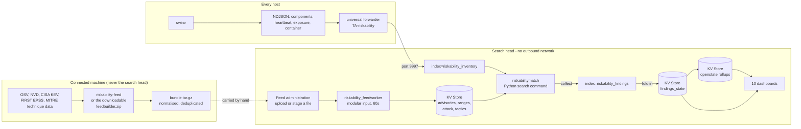

One package ships. `riskability` carries everything a search head needs, plus
the index definitions and the index-time parsing, so a single instance - one
Splunk that is both search head and indexer - works on install:

| Package | Deploy to | Contains |
|---|---|---|
| **`riskability`** | search heads, and single instances | dashboards, matcher, admin backend, KV Store collections, field extraction, index definitions, index-time parsing |

The one thing that cannot go everywhere is the app itself, on a **universal
forwarder**. A forwarder ships no Python, so the modular input cannot be
introspected and splunkd logs an error on every restart. A forwarder needs six
lines of `inputs.conf` and nothing more.

For convenience the repository also builds `TA-riskability` (that input, for
forwarders) and `TA-riskability-indexes` (the index definitions alone, for
indexers that should not carry the whole app). Neither is on Splunkbase,
because a listing takes exactly one archive.

An earlier version of this app really could not put `indexes.conf` on a
forwarder: it set `tstatsHomePath` to a `volume:` path a forwarder cannot
resolve. Splunk sets that setting globally for every index anyway, so naming it
per stanza only restated the default. Removing it - which Splunk Cloud vetting
required independently - is what made a single package possible.

### How it actually works

Nothing here is a daemon. Every moving part is either a Splunk scheduled search,
a Python search command, or a modular input, so it is all visible in Splunk's own
job inspector and logs.

| Component | Kind | Job |
|---|---|---|
| `riskabilitymatch` | custom search command (`bin/riskability_match.py`) | Takes inventory rows, decides which are actually vulnerable, emits findings |
| `riskability_feedworker` | modular input, 60s interval | Imports a staged bundle into the KV Store; also performs the opt-in direct fetch |
| `riskability_feed_admin` | REST handler (`/riskability/feed`) | What **Feed administration** talks to: upload, stage, import, verify |
| `riskability_exceptions` | REST handler (`/riskability/exceptions`) | Create, edit and revoke risk exceptions; writes the audit trail |
| `riskabilityvercmp` | custom search command | Compares two versions the way the matcher would, for debugging a verdict |
| 28 scheduled searches | `savedsearches.conf` | The hourly pipeline below |

The matcher is split into small modules with one job each, because each is a
place a wrong answer comes from:

| Module | Decides |
|---|---|
| `scope.py` | Which filesystem root a component belongs to, and therefore which OS it should be judged against |
| `purl.py` | What a package really is: its name, its ecosystem, and the source package behind a binary |
| `vercmp.py` | Whether one version precedes another, using each ecosystem's own rules rather than string order |
| `match.py` | Whether an advisory applies at all: distro, release, variant, authority and confidence |
| `feed.py` | The bundle format, and normalising a dozen upstream shapes into one |
| `importer.py` | Loading a bundle into the KV Store atomically, by generation |
| `build.py` | Fetching upstream feeds and assembling a bundle, on a connected machine |

#### The hourly pipeline

The order is a contract rather than a convenience. Closing a finding is gated on
evidence that the matcher's output actually reached the state collection, and
that evidence is produced by four different searches at four different minutes.
`tools/pipeline_order.py` prints the real order from the shipped conf file.

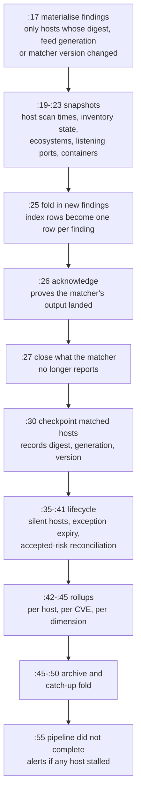

Two properties fall out of that shape, and both are the point:

**Only changed hosts are re-matched.** A host is due for re-matching when its
inventory digest, the feed generation, or the matcher version has moved - or
when it has not been matched for 24 hours, so a host that failed for any reason
heals itself. Everything else is skipped, which turns the hourly cost from
O(fleet) into O(changed). The collector can send a small heartbeat carrying a
digest instead of its whole component list; the app computes the digest itself
for collectors that do not.

**Dashboards read rollups, not findings.** Hourly searches maintain per-host,
per-CVE and per-dimension summaries, so a fleet total is a read of a few
thousand rows rather than a few million. The cost is that those pages lag by up
to an hour, which **Fleet overview** states next to the numbers and warns about
when the lag is longer than it should be.

**Convergence is two cycles**, measured on a rebuilt-from-nothing instance by
`tools/test_fresh_install.sh`: the first produces the final count, the second
confirms it is stable.

#### Where state lives

| Where | Holds | Why there |
|---|---|---|
| `index=riskability_inventory` | What swinv reported, 30 days | Append-only; every scan is a complete statement |
| `index=riskability_findings` | Findings as produced, 1 year | The matcher's raw output, before lifecycle |
| `index=riskability_findings_archive` | What was found and when it was fixed, 2 years | History, kept out of the working set |
| `index=riskability_audit` | The risk-exception trail, 5 years | Append-only: a register anyone can rewrite is not an audit trail |
| KV Store, 23 collections | The feed, current finding state, rollups, exceptions | Indexed lookups; a search-time join at fleet scale is not viable |

#### The tools

| Script | Does |
|---|---|
| `tools/riskability-feed` | Builds a bundle from upstream feeds, on a connected machine |
| `tools/make-feedbuilder.sh` | Packs that builder into the self-contained zip the admin page offers |
| `tools/riskability-scan` | Runs the exact matching logic against a swinv file with no Splunk at all |
| `tools/package.sh --verify` | Builds the three `.spl` files and checks what is inside them |
| `tools/deploy-dev.sh`, `tools/deploy-uf.sh` | Sync into the local Splunk and forwarder |
| `tools/build-viz.sh` | Builds the two ECharts visualizations and bumps the asset cache key |
| `tools/test_fresh_install.sh` | Rebuilds everything from nothing and asserts 95 things about it |
| `tools/build_demo_instance.sh` | Builds a populated demo instance from nothing, in the order a user installs in |
| `tools/pipeline_cycle.sh` | Runs one full pass of the hourly pipeline on demand, rather than waiting for the hour |
| `tools/test_*.py`, `tools/audit_claims.py` | Matching, scope and comparator suites; recomputes this file's numbers |

### Installing

#### 0. Install the collector first

Riskability correlates what [`swinv`](https://github.com/chaugan/swinv)
reports. It collects nothing itself. Install swinv on the hosts you want
assessed, following its own instructions, then run it with the flags this app
needs.

Linux:

```sh
sudo swinv --out /var/lib/swinv \
           --format ndjson \
           --ndjson-include all \
           --heartbeat \
           --output-mode overwrite \
           --latest-symlink=false
```

Windows:

```powershell
swinv.exe --out C:\ProgramData\swinv `
          --format ndjson `
          --ndjson-include all `
          --heartbeat `
          --output-mode overwrite `
          --latest-symlink=false
```

The output directory is an example; use whatever you monitor, and keep the
forwarder input pointing at the same place.

| Flag | Why this app wants it |
|---|---|
| `--format ndjson` | The only format this app reads. One JSON object per line, which is what lets Splunk break events without parsing a whole document |
| `--ndjson-include all` | Adds the `exposure` and `container` records. **Without this there is no reachability at all**: every finding is reported as "not assessed", the Exposure dashboard has nothing to draw, and container findings cannot be told apart from host ones |
| `--heartbeat` | Puts a digest at the head of every scan. The app checkpoints each host against that digest and re-matches only hosts whose software actually changed, so an unchanged host costs one row per scan instead of its whole inventory |
| `--output-mode overwrite` | One fixed filename per host, replaced each run, so the directory cannot grow without bound. The default `timestamped` keeps every scan forever and has no retention of its own, which means you have to prune it yourself |
| `--latest-symlink=false` | Stops swinv writing `<host>-latest.ndjson`. Monitoring a symlink would re-read the whole inventory on every scan, which is why the shipped input blacklists it. Turning it off is cleaner than filtering it out |

#### Why monitoring an overwritten file is safe here

This is worth spelling out, because it is normally a trap. Splunk fingerprints
the first 256 bytes of a file to decide whether it has seen it before, and if
the fingerprint matches it resumes from the byte offset it stored last time. A
file that is replaced in place rather than appended to breaks that assumption.
With `--heartbeat` the effect is dramatic: a quiet scan ships only a digest, so
the file collapses from megabytes to tens of kilobytes and then grows back on
the next change. If Splunk thought it were the same file, it would resume at
the old offset and silently skip the beginning of the next full scan.

It does not happen, because **every swinv NDJSON line carries `scanned_at`**,
and on both record types it falls inside the first 256 bytes: byte 141 on a
plain component line in the sample data here. So the fingerprint differs on
every scan, Splunk treats each run as a new file and reads all of it. No gaps
and no duplicates. This holds with or without `--heartbeat`.

swinv also writes atomically, to a temp file that is then renamed, so the inode
changes on every run and Splunk can never read a half-written inventory.

`--heartbeat` earns its place for a different reason: it lets the app re-match
only hosts whose software actually changed. It is not what makes `overwrite`
safe.

If you prefer `--output-mode timestamped`, the shipped input handles it: that is
what `crcSalt = <SOURCE>` and the `-latest` blacklist are for. Just remember to
prune the directory.

Confirm something is being written before going further:

```sh
ls -l /var/lib/swinv/*.ndjson
head -1 /var/lib/swinv/*.ndjson    # should be a record_type of heartbeat
```

Doing this first is worth the few minutes. With no inventory arriving there is
nothing to correlate, every dashboard reads zero, and the app cannot tell that
apart from a fleet with no vulnerabilities - which is why it says "no data"
rather than showing a clean bill of health.

#### 1. Get the package

Download `riskability-<version>.tar.gz` from
[Splunkbase](https://splunkbase.splunk.com/) or from the
[GitHub releases page](https://github.com/chaugan/riskability/releases), or
build it yourself:

```sh
tools/package.sh --verify        # builds dist/*.spl and .tar.gz, and checks each is complete
```

Each release carries a `SHA256SUMS.txt`. On an air-gapped transfer it is worth
checking what arrived is what left:

```sh
sha256sum -c SHA256SUMS.txt
```

#### 2. Install it

```sh
# Splunk Web: Manage Apps, then Install app from file. Or on the command line:
splunk install app riskability-<version>.tar.gz
splunk restart
```

If you unpack the archive by hand instead, which is the natural thing to do on
an air-gapped box, the files end up owned by whoever ran `tar` and splunkd
cannot write inside its own app directory. The symptom is that **"this app has
not been fully configured yet" keeps interrupting every navigation forever**,
even with a feed imported, because clearing that gate is itself a write:

```sh
chown -R splunk:splunk $SPLUNK_HOME/etc/apps/riskability
```

**The Splunkbase download is one archive, `riskability-<version>.tar.gz`, and
it is the whole app.** Install it on the search head. On a single instance -
one Splunk that is both search head and indexer, which is the usual shape for
an air-gapped deployment - that is the entire installation. The four indexes
and the index-time parsing ship inside it, so it works on install rather than
after a manual step.

A **distributed** deployment needs two small additions, because a universal
forwarder cannot run this app: it has no Python for the modular input, and
would log an introspection error on every restart. Both are a handful of lines,
given in full under "Configuring the universal forwarder" and "Index names"
below.

| Role | What it needs |
|---|---|
| Search head | The app. Nothing else |
| Indexer | The app's `default/indexes.conf` and its `[riskability:swinv]` parsing, copied into an app of your own. A universal forwarder does not parse, so this must be on the indexers |
| Universal forwarder | Six lines of `inputs.conf`. Nothing else |

The repository also carries `TA-riskability` and `TA-riskability-indexes`,
prebuilt for those two roles if you would rather install an archive than paste
a stanza. They are not on Splunkbase - a listing takes one archive - so build
them with `tools/package.sh` or take them from the GitHub release.

Everything the app needs at runtime is inside those archives - the KV Store
collections and their indexes, the search commands, the modular input and its
spec file, the admin endpoint and its Splunk Web exposure, the dashboards, and
the vendored SDK. `--verify` exists because a fix that only lives on a
developer's instance is not a fix; it is a difference between what was tested
and what a user installs.

Three things are **not** app configuration and must be done on the deployment:

1. **Enable receiving on the indexers**, if it is not already on:
   `splunk enable listen 9997`. Shipping this in an app would silently open a
   port on someone's instance.
2. **Enable the file input on the forwarders** - see below. It ships disabled
   deliberately.
3. **Import a feed.** The app has no vulnerability data until you give it some,
   and says so on every dashboard rather than showing zeroes that look like
   good news. Open **Feed administration**, which is where a fresh install
   lands, download the feed builder, run it on a machine with internet access,
   and bring the resulting `.tar.gz` back. Importing it is what clears the
   setup gate.

The KV Store must be running on the search head; the feed lives there.

### What the app reads from the collector

Every line the forwarder ships is one JSON object. The app reads four kinds,
distinguished by `record_type`:

| `record_type` | Carries | Without it |
|---|---|---|
| *(absent)* | one installed component | there is nothing to assess |
| `heartbeat` | a digest and a component count, sent when nothing changed | every quiet scan ships the whole inventory again |
| `exposure` | one listening port, the process holding it, and the package behind it | every finding is reported as **not assessed** on the Exposure page - never as safe |
| `container` | one container, its image, its state and its published ports | container findings are still matched, but nothing says which of them are running or reachable |

The last two are what the **Exposure** page is built on. A collector that does
not emit them leaves the page honest but empty: hosts appear under "never
reported a listening port" and their findings sit in the dashed *not assessed*
row of the matrix, which is deliberately not the same place as "nothing is
listening".

An `exposure` record carries one port and one component, so a port served by
three packages arrives as three records. The package **name** is derived here
rather than shipped: from the purl's name segment, with the distro namespace
dropped for `deb`, `rpm` and `apk`, and from the `Name@Version` string on
Windows, where there is no purl to give. Checked against the component records
of both dev hosts - 22 of 22 Linux purls and 18 of 18 Windows strings derive the
same name the inventory reports, which is what lets a finding be joined to a
port by package alone.

`os_component` on an exposure record means the port is answered by the operating
system itself - Windows `System` and `svchost`. Those are counted separately
from ports nothing could be attributed to, because they are not the same fact:
one is a listener the app can see and cannot assess against a package feed, the
other is one it could not identify at all.

### Configuring the universal forwarder

Do not install the app itself on a universal forwarder. A forwarder ships no
Python, so the app's modular input cannot be introspected and splunkd logs an
error on every restart. The forwarder needs the input and nothing else.

This is the whole of it. Put it in an app of your own on the forwarder, or use
the prebuilt `TA-riskability`, or push it with a deployment server:

```ini
# <your-app>/local/inputs.conf on the forwarder
[monitor:///var/lib/swinv/*.ndjson]
disabled = 0
index = riskability_inventory
sourcetype = riskability:swinv
crcSalt = <SOURCE>
blacklist = -latest\.ndjson$
```

`crcSalt = <SOURCE>` matters. swinv's output is deterministic apart from
timestamps, so two scans of an unchanged host share a long identical prefix,
and without a source-based CRC salt Splunk treats the new file as one it has
already read and skips it. The blacklist matters too: swinv writes a
`<host>-latest.ndjson` symlink beside the real files, and monitoring it would
re-read the entire inventory on every scan.

If you install `TA-riskability` rather than pasting the above, note that it
ships the input **disabled** - installing an add-on must not silently start
reading a customer's filesystem - so you still set `disabled = 0` in its
`local/inputs.conf`.

and point the forwarder at your indexers as usual:

```ini
# outputs.conf
[tcpout]
defaultGroup = riskability_indexers

[tcpout:riskability_indexers]
server = idx1.example.net:9997, idx2.example.net:9997
```

### Index names

The app writes to four indexes and ships their definitions in `default/indexes.conf`:

| Index | Holds | Retention |
|---|---|---|
| `riskability_inventory` | what swinv reported | 30 days |
| `riskability_findings` | findings as they were produced | 1 year |
| `riskability_findings_archive` | what was found and when it was fixed | 2 years |
| `riskability_audit` | the risk-exception trail, append-only | 5 years |

The names are not hardcoded. Four macros - `riskability_index_inventory`,
`_findings`, `_archive` and `_audit` - are the only place they appear in SPL, so
a site with its own naming scheme overrides them in `local/macros.conf` and
everything follows: dashboards, the matcher, the lifecycle jobs, the audit
trail. The **Feed administration** page writes those overrides for you.

Two things do not follow automatically, because they are not the app's to
change: the forwarder's `inputs.conf` must send to the same index, and on a
distributed deployment the indexes must exist **on the indexers**. The app's
own `indexes.conf` covers a single instance; for a distributed one, copy it to
the indexers, or into the cluster manager's bundle, alongside the
`[riskability:swinv]` parsing from the app's `props.conf` - a universal
forwarder does not parse, so index-time settings have to be where the data is
indexed. A site using its own index names creates those instead.

Nothing here needs `tstatsHomePath`. Splunk's own `system/default/indexes.conf`
sets it globally for every index, and naming it per stanza only restates the
default - which is also why an earlier version of this app could not be
deployed to a forwarder, and why Splunk Cloud rejected it.

### The forwarder input, and what it inherits

That `local/` stanza does not repeat everything the input needs, and does not
have to. Splunk merges configuration per attribute: `local/` wins for the
attributes it names, and every attribute it does not name is still taken from
`default/`. So the two settings below apply whether or not you write them out.

- **`crcSalt = <SOURCE>`**, shown above and also in the shipped default. swinv's
  output is deterministic apart from the timestamps, so two scans of an
  unchanged host share a long identical prefix. Without a source-based CRC salt
  Splunk recognises the new file as one it has already read and skips it
  entirely.
- **`blacklist = -latest\.ndjson$`**, in the shipped default only - it is not in
  the example above because there is no need to restate it. swinv writes a
  `<host>-latest.ndjson` symlink beside each scan. Monitoring the symlink as
  well would re-read the whole inventory every run: re-pointing a symlink does
  not reliably raise a new-file event, and its target changes name every scan.

Read the shipped file at `TA-riskability/default/inputs.conf` if you want to see
exactly what you are inheriting; it carries both settings and the reasoning.

Have swinv write NDJSON, which is the format the input expects:

```sh
swinv --format ndjson --out /var/lib/swinv
```

Index-time parsing (line breaking and the timestamp) takes effect on the
**indexer**, because a universal forwarder does not parse. On a single instance
the app's own `props.conf` covers it. On a distributed one, copy the
`[riskability:swinv]` stanza and `indexes.conf` to the indexers.

Matching runs in Python because Splunk cannot express dpkg or RPM version
ordering in SPL. It never streams over raw inventory: the caller reduces to
latest state first, and each chunk becomes a handful of KV Store queries keyed
on `(ecosystem, package)`, so work scales with distinct packages rather than
hosts × packages.

---

## Getting vulnerability data in

On a machine with internet access:

You do not need this repository. **Feed administration** offers a
self-contained `riskability-feedbuilder.zip` for download: unzip it on a
connected workstation and run the wrapper for your platform. It carries its own
code and needs no checkout and no install step. `tools/riskability-feed` is the
same builder for anyone who does have the repo.

```sh
tools/riskability-feed sources                 # what can be fetched, and how big

tools/riskability-feed build --out riskability-feed.tar.gz \
    --ecosystem Ubuntu --ecosystem npm --ecosystem PyPI \
    --ecosystem Go --ecosystem crates.io \
    --kev --epss --mitre
```

Only the sources you name are downloaded. Name the distributions you actually
run: add `--ecosystem Debian`, `--ecosystem Alpine`, `--ecosystem Rocky` and so
on. **`--mitre` is not optional if you want the MITRE ATT&CK page** - without
the technique-to-tactic mapping that flag fetches, that dashboard is empty, and
the page says so rather than implying nothing is exposed.

The bundle measured below is Ubuntu plus npm, Go, PyPI and crates.io, with
EPSS - which is what the command above builds, minus `--kev` and `--mitre`. It is
**40.9 MB** and holds 323,387 advisories and 2,960,955 affected
ranges, normalised down from about 884 MB of raw upstream feeds. It imports into
the KV Store in roughly five minutes. (The size and advisory counts are
recomputed by `audit_claims.py`; the raw-feed size and the import time are
measurements from a run, not from a file in this repository.)

Carry the bundle across, then either drop it in
`$SPLUNK_HOME/var/run/riskability/incoming/` or upload it on the **Feed
administration** page, and click Import. An import replaces the previous feed
rather than merging with it, and the old one stays queryable until the new one
has finished.

### Why a normalised bundle rather than the raw feeds

- Upstream formats disagree wildly (OSV JSON, OVAL XML, CSAF, `updateinfo.xml`,
  CSV). Parsing all of them inside Splunk's Python would be slow, fragile, and
  would need an app upgrade for every new format.
- Redistribution terms differ per source. A bundle **you** built from sources
  **you** chose sidesteps the question of what this app may ship - which is why
  nothing is shipped pre-loaded.
- The matcher wants exactly one shape.

### Licensing

OSV aggregates sources that are individually CC-BY-4.0 (GitHub, Red Hat),
CC-BY-SA-4.0 (Ubuntu), MIT (AlmaLinux) and BSD (Rocky); CISA KEV is
US-government public domain; EPSS is published by FIRST and expects
attribution. Every record keeps the source it came from, so attribution
survives into Splunk. Building a bundle for your own organisation is
uncontroversial; redistributing one is your decision, not this app's.

---

## Accepting a risk, and proving you did

Not every finding gets patched. **Risk exceptions** records the ones that do not:
the CVE, what it applies to, why, what control is in place instead, who decided,
and when it must be reviewed again. Accepted findings are removed from every risk
number on every page and counted separately, so they are never quietly dropped -
"no open findings" alongside four hundred accepted ones is not a clean fleet, and
the pages say so.

The decisions are also written to a separate append-only index, `riskability_audit`,
kept for five years. That is deliberate: a register that can be rewritten by
whoever can write the register is not an audit trail. Expiries are reconciled by a
scheduled search, so a lapsed exception puts its findings back into the open counts
without anyone remembering to do it.

---

## What makes it work on a fleet rather than a laptop

Matching every component on every host against the whole feed, every hour, does
not scale, and neither does a dashboard that re-derives fleet totals on each load.
Two mechanisms avoid both.

**Only changed hosts are re-matched.** The collector can send a small heartbeat
carrying a digest of its component list; the app checkpoints each host against
`(inventory digest, feed generation, matcher version)` and re-runs the matcher only
where one of the three moved. An unchanged host costs one row per scan instead of
its entire inventory. There is a daily floor as well, so a host that failed to
match for any reason heals itself rather than staying stale forever, and the app
computes the digest itself for collectors that send no heartbeat.

**Dashboards read rollups, not the finding state.** Hourly scheduled searches
maintain per-host, per-CVE and per-dimension summaries, so a fleet total is a read
of a few thousand rows rather than a few million. The cost is that those pages lag
by up to an hour, which **Fleet overview** states next to the numbers and warns
about when the lag is longer than it should be.

---

## Dashboards

Eleven views, in nav order.

| View | Answers |
|---|---|
| **Start here** | What the numbers on every other page mean, and what they do not. The default landing page |
| **Fleet overview** | How stale is the feed, how many hosts report, where is the risk concentrated |
| **Findings** | Every finding, ranked by EPSS (exploitation likelihood) rather than CVSS |
| **Remediation** | What was actually fixed, and what merely stopped being reported |
| **MITRE ATT&CK** | Which adversary techniques the open findings could enable. Context, not evidence |
| **Exposure** | Which findings the network can reach, and which sit inside containers |
| **Hosts** | Per-host detail, split by filesystem root |
| **Coverage** | What the feed *cannot* say anything about |
| **Risk exceptions** | Findings someone accepted, why, until when, and who said so |
| **CVE encyclopaedia** | What any vulnerability the feed carries actually is, and where it sits in this fleet. Offline |
| **Feed administration** | Build, upload and import bundles |

### The CVE encyclopaedia, and why it needs a source of its own

Every other page answers "where is this in my fleet". This one answers "what is
this", which on a search head with no route to the internet you otherwise have
to leave the room to find out.

Most of what it shows was already in the feed and being thrown away. The CISA
KEV catalogue carries a vendor, a product, a plain English description and the
remediation CISA requires, and the importer kept three date fields out of ten.
Descriptions were truncated at 500 characters. Distribution advisories carry no
summary at all, which is why 114,560 rows have an empty title, but several
advisories describe one CVE and the others usually do have text: taking the
longest recovers a description for 640,830 of the 641,374 CVEs a full bundle
knows about.

What the feed genuinely lacked is a product name in the words a person uses.
Distro and ecosystem advisories describe packaging: `pkg:deb/ubuntu/libwebp`,
not "Google Chrome". The CVE Program's own records carry a vendor and product
per affected entry, so `--cve-list` adds them:

```sh
riskability-feed build --out feed.tar.gz \
    --ecosystem Ubuntu --nvd 2015-2026 --kev --epss --mitre \
    --cve-list
```

It is opt in because it is not free: about 600 MB to download on the connected
machine and roughly 120 MB in the bundle you carry. Without it the page still
works and still shows a description for almost every CVE; it simply cannot name
a product for the ones CISA has not catalogued.

The catalogue lives in the KV Store rather than in a file, which was not the
first answer. A local file suits the access pattern better, since a page reads
exactly one row and an import replaces the lot. It was built that way, tested,
and then discarded, because `var/` is replicated nowhere: on a search head
cluster every member would have needed its own copy, its own command to build
it, and nothing to reconcile them. The KV Store already holds 1.6 GB across
5.78 million documents here and every import already replaces 4,991,357 of
them, so another 290,000 rows is a 5% increase in documents to make
distribution somebody else's problem.

References are deliberately not carried. Measured across the catalogue they
cost 52 MB to store URLs that cannot be followed from a machine with no
internet. Product names cost 10 MB, and are the entire point.

**Any CVE id in any table in the app is a link to this page.** It is a cell
formatter in the table visualization rather than a per panel drilldown, so it
works everywhere a CVE appears, shows the reader that the cell is live, and
cannot fight the row selection that Findings needs for accepting a risk.

Screenshots below are from a two-host test fleet - one Linux, one Windows - built
from nothing by `tools/build_demo_instance.sh`, with a feed carrying 793,058
advisories. The numbers in them are the ones this README quotes.

### Start here
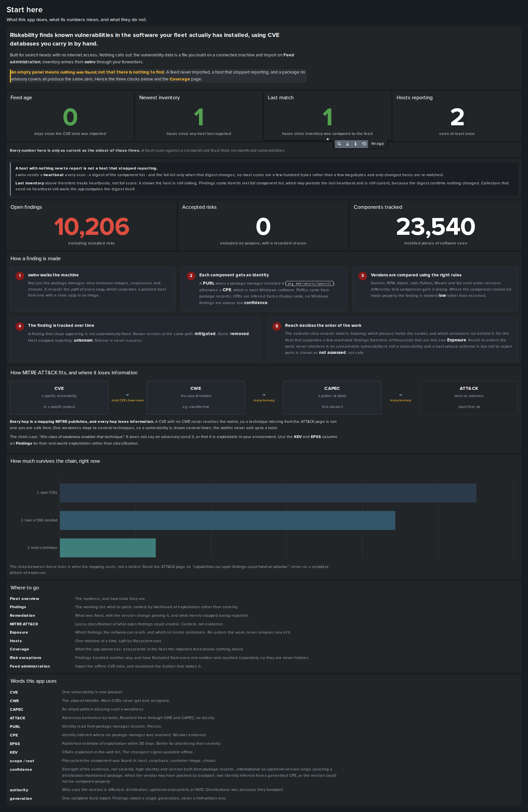

### Fleet overview
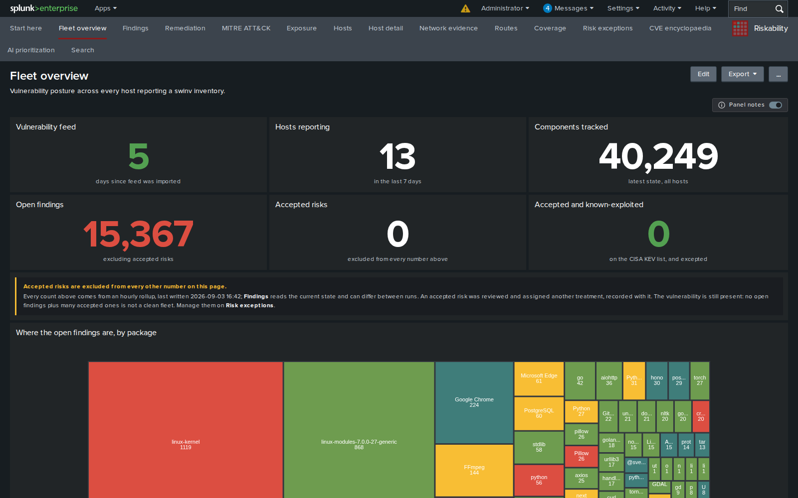

### Findings
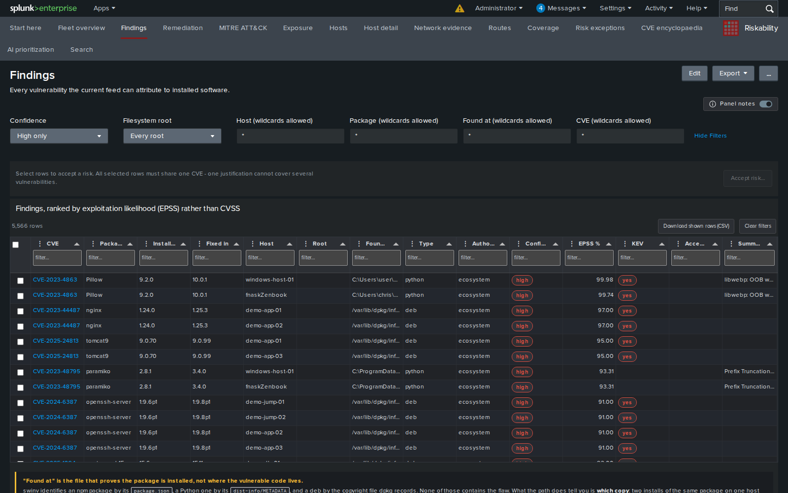

### Remediation
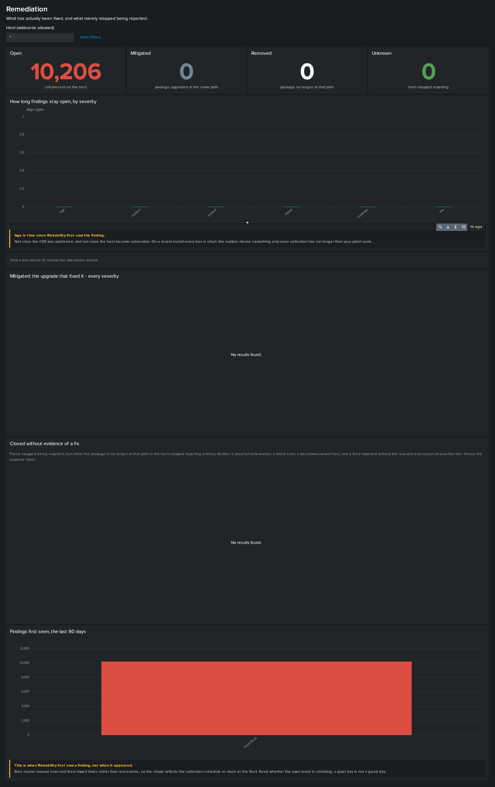

### MITRE ATT&CK
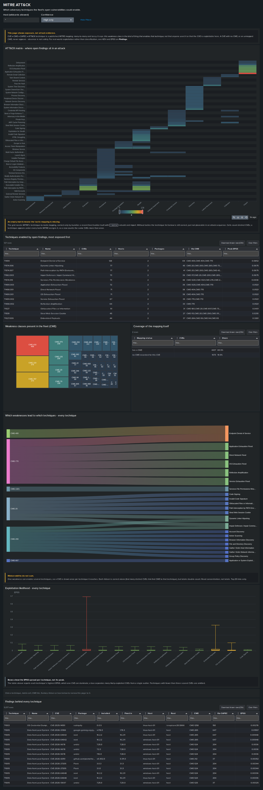

### Exposure
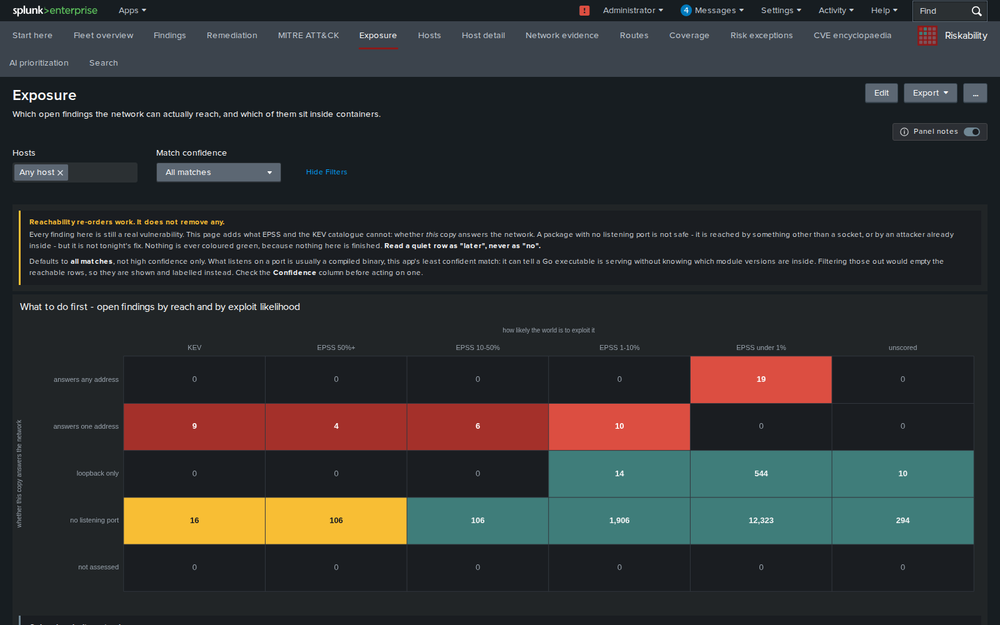

### Hosts
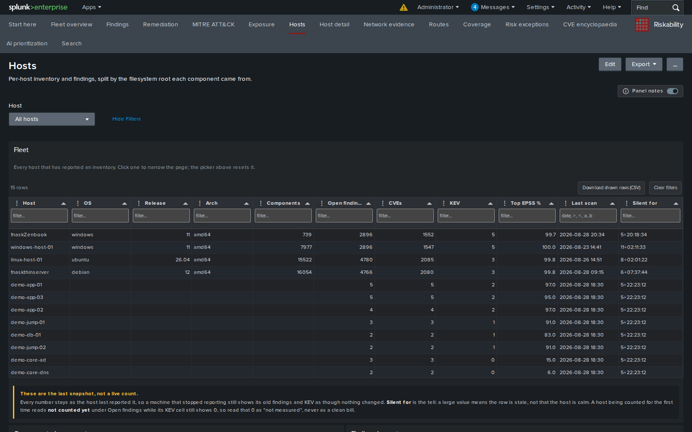

### Coverage
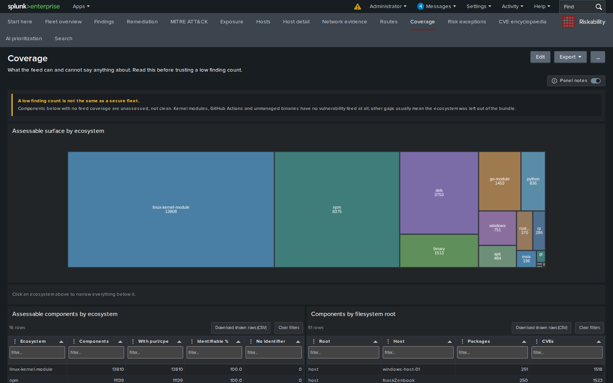

### Risk exceptions
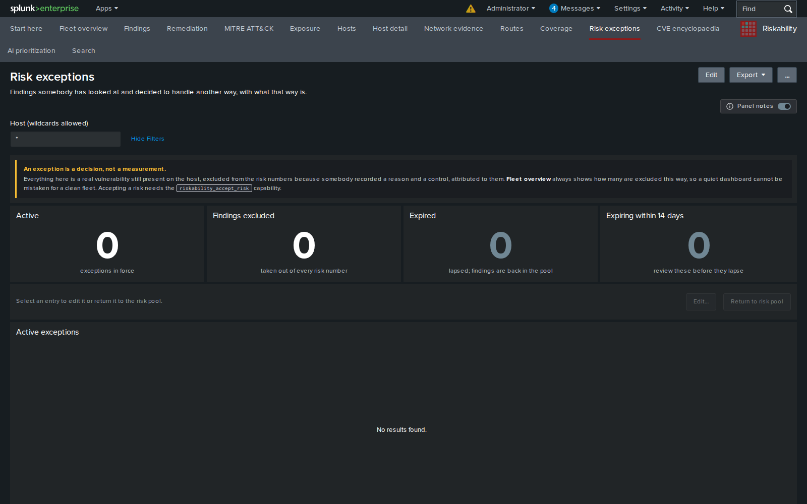

### CVE encyclopaedia
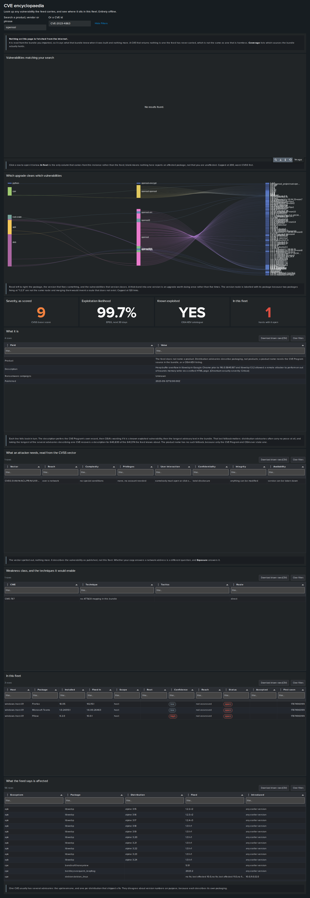

### Feed administration
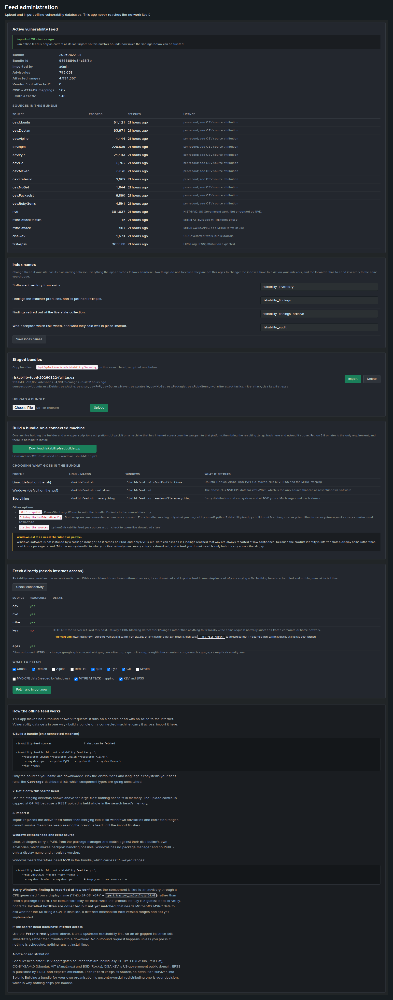

An import runs on the server and does not need the page kept open. The active
feed stays searchable throughout, so importing does not blind the fleet:

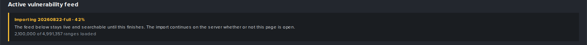


---

## Development

```sh
docker/                       Splunk 9.4 plus a real universal forwarder
tools/deploy-dev.sh           sync the search-head app into it (preserves local/)
tools/deploy-uf.sh            install the add-on into the forwarder
tools/build-viz.sh            build the two custom visualizations, bump the cache key
tools/make-feedbuilder.sh     build the downloadable feed builder
tools/riskability-feed        build a bundle from upstream feeds
tools/riskability-scan        run the exact matching logic offline, no Splunk
tools/test_*.py               the test suites
```

Run the tests:

```sh
python3 tools/test_vercmp_differential.py   # vs the real dpkg and rpm
python3 tools/test_vercmp_spec.py           # vs each ecosystem's spec
python3 tools/test_match.py                 # matching and precedence
python3 tools/test_scope_purl.py            # regressions from real inventory
python3 tools/audit_claims.py               # recompute the inventory and feed numbers
```

`audit_claims.py` exists because a claim in this README was once a
generalisation from a single example rather than a measurement. Every number
drawn from the inventory or the feed is recomputed by that script, so it can be
checked rather than trusted.

Four figures are not, and are marked in the text where they appear: the size of
the raw upstream feeds, how long an import takes, and the fleet-wide exposure
and reachability splits. Those come from a running instance rather than from a
file in this repository, so the script cannot reach them.

`tools/riskability-scan` is the fastest way to sanity-check behaviour, because
it runs the app's matching logic against a `swinv` file with no Splunk involved:

```sh
tools/riskability-scan inventory.json riskability-feed.tar.gz
```

---

## Status

Working and verified end to end against real inventory from a 14,349-component
Ubuntu host and a 502-component Windows host, both checked in under
`testdata/ndjson/` so the numbers in this file can be recomputed rather than
taken on trust.

**Windows is supported, at low confidence only.** swinv emits no PURL for
Windows software, so identity comes from CPEs generated from the display name
and version - 488 of 502 components on the test host carry at least one. The
matcher tries several candidate CPEs per component and caps every resulting
finding at `low`, because the product identity is inferred rather than read from
a package record. Treat them as leads to verify.

Installed hotfixes are collected but not yet matched. Doing that properly means
MSRC CSAF data keyed CVE → KB → OS build, asking whether the KB that fixes a CVE
is installed, rather than comparing version ranges. That is not implemented.

## Licence

Apache-2.0. See `LICENSE`.
